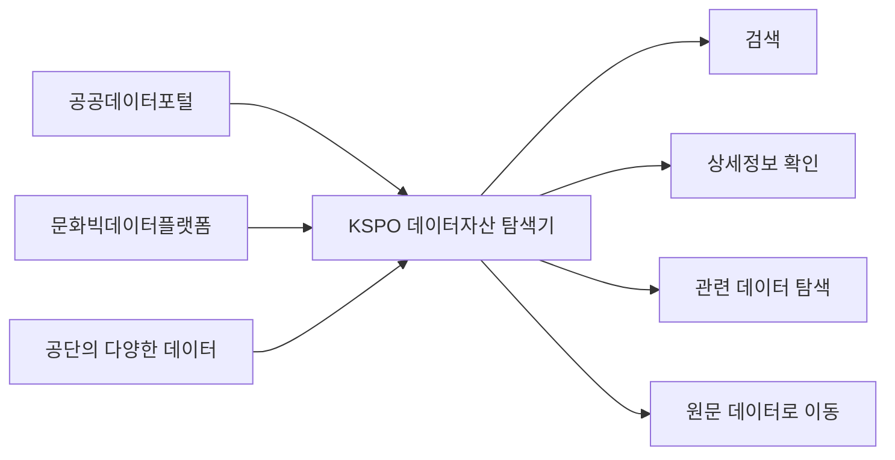
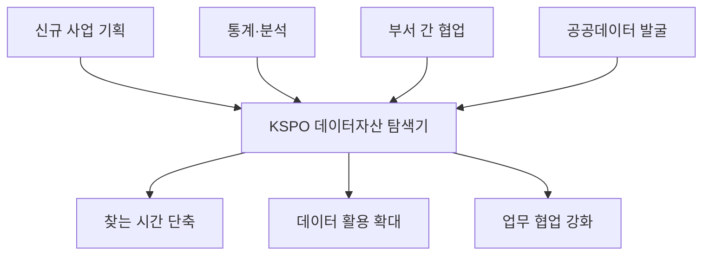
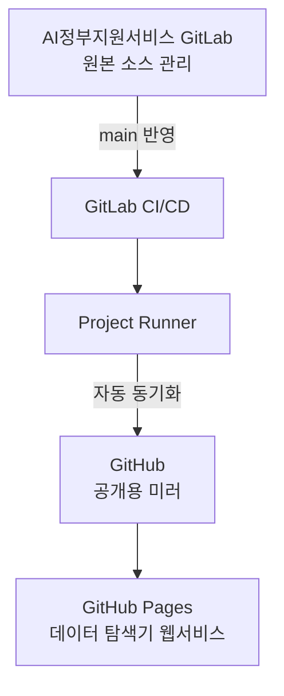

# KSPO 데이터자산 탐색기

> **공단에 어떤 데이터가 있는지 찾기 위해 여러 사이트를 돌아다닐 필요 없이, 한 화면에서 검색·확인하고 실제 공개 데이터까지 연결해 주는 서비스입니다.**

### 👉 [KSPO 데이터자산 탐색기 바로가기](https://pinkshark1.github.io/kspo_data_explorer/)

---

### 왜 만들었나요?

공단의 데이터는 **공공데이터포털, 문화빅데이터플랫폼 등 여러 곳에 나뉘어 공개**되어 있습니다.

따라서 필요한 데이터가 있어도

- 우리 공단에 어떤 데이터가 있는지
- 어디에서 공개되고 있는지
- 비슷하거나 연관된 데이터는 무엇인지
- 실제 파일이나 API는 어디에서 받을 수 있는지

를 각각 찾아봐야 했습니다.

**KSPO 데이터자산 탐색기는 이 과정을 한 화면에서 할 수 있도록 만든 ‘KSPO 데이터 안내지도’입니다.**



---

## 이 화면에서 무엇을 할 수 있나요?

| 하고 싶은 일 | 탐색기에서 할 수 있는 것 |
|---|---|
| **공단에 어떤 데이터가 있는지 알고 싶다** | 데이터명·키워드로 통합 검색 |
| **필요한 데이터만 골라보고 싶다** | 분야, 출처, 제공형태, 업데이트 주기 등으로 필터 |
| **데이터가 무슨 내용인지 알고 싶다** | 데이터 설명과 주요 정보를 한 화면에서 확인 |
| **비슷한 데이터도 같이 보고 싶다** | 데이터 간 연계관계를 시각적으로 확인 |
| **실제 데이터를 받고 싶다** | 공공데이터포털·문화빅데이터플랫폼 등 원문으로 바로 이동 |

### 한마디로

**찾기 → 확인하기 → 관련 데이터 보기 → 실제 데이터 이용하기**까지 한 번에 이어집니다.


---

## 언제 쓰면 좋나요?

### 1. 신규 사업을 기획할 때
> “이 사업과 관련해 우리 공단에 이미 활용할 수 있는 데이터가 있나?”

관련 데이터를 먼저 확인해 **사업 기획의 근거자료**로 활용할 수 있습니다.

### 2. 통계·분석 자료를 만들 때
> “필요한 데이터가 어디에 공개되어 있지?”

여러 사이트를 각각 검색하지 않고 **관련 데이터 후보를 먼저 찾아 비교**할 수 있습니다.

### 3. 다른 부서와 협업할 때
> “다른 업무에서 비슷한 데이터를 이미 가지고 있지 않을까?”

관련 데이터와 연결관계를 확인해 **중복 수집을 줄이고 데이터 연계 가능성**을 찾을 수 있습니다.

### 4. 공공데이터를 추가로 개방할 때
> “이미 공개된 데이터와 아직 부족한 데이터는 무엇일까?”

현재 공개된 데이터 자산을 먼저 파악해 **신규 개방 후보 발굴**에 활용할 수 있습니다.



---

## 사용 방법은 어렵지 않습니다

별도의 프로그램 설치나 회원가입 없이 웹 브라우저에서 바로 사용할 수 있습니다.

### STEP 1. 탐색기에 접속합니다

👉 **https://pinkshark1.github.io/kspo_data_explorer/**

### STEP 2. 찾고 싶은 단어를 검색합니다

예를 들어 다음과 같이 검색할 수 있습니다.

- 체력
- 스포츠강좌
- 체육시설
- 경륜·경정
- 스포츠산업
- 체육진흥기금

### STEP 3. 필요한 조건으로 범위를 좁힙니다

분야, 데이터 출처, 제공 형태, 업데이트 주기 등을 이용해 필요한 데이터만 확인합니다.

### STEP 4. 데이터 상세정보와 관련 데이터를 확인합니다

해당 데이터의 설명과 제공 정보를 보고, 연관된 데이터가 있다면 관계도에서 함께 살펴봅니다.

### STEP 5. 필요하면 원문 데이터로 이동합니다

실제 활용이 필요하면 연결된 공공데이터포털 또는 문화빅데이터플랫폼 등으로 이동해 원문 데이터를 확인합니다.

---

## 기존 방식과 무엇이 다른가요?

| 기존 | KSPO 데이터자산 탐색기 |
|---|---|
| 여러 사이트를 각각 방문 | **한 화면에서 먼저 통합 탐색** |
| 정확한 데이터명을 알아야 찾기 쉬움 | **키워드와 분류를 이용해 탐색** |
| 데이터 하나씩 개별 확인 | **관련 데이터를 함께 확인** |
| 어디서 원문을 받는지 다시 검색 | **원문 공개 사이트로 바로 이동** |

> **핵심은 데이터를 새로 만드는 것이 아니라, 이미 공단이 보유·개방하고 있는 데이터를 더 쉽게 발견하고 활용하도록 돕는 것입니다.**

---

## 기대 효과


- **데이터 접근성 향상** : 공단 데이터를 어디서 찾아야 하는지 쉽게 파악
- **업무시간 단축** : 여러 플랫폼을 반복 검색하는 시간 감소
- **데이터 활용 확대** : 기존 데이터의 재발견 및 분석·기획 활용 촉진
- **협업 강화** : 다른 분야의 관련 데이터를 쉽게 확인
- **공공데이터 발굴 지원** : 현재 개방 현황을 바탕으로 추가 개방 후보 검토

---

# 운영자 참고

아래 내용은 일반 이용자가 아니라 **데이터 탐색기 운영·관리 담당자**를 위한 내용입니다.

## 서비스 운영 구조

개발·원본 관리는 **AI정부지원서비스 GitLab**, 공개 웹페이지는 **GitHub Pages**를 이용합니다.



| 구분 | 역할 |
|---|---|
| **GitLab** | 원본 소스 관리 및 수정 |
| **GitHub** | 외부 공개를 위한 미러 저장소 |
| **GitHub Pages** | 실제 데이터 탐색기 웹서비스 |

> **운영 원칙: GitLab = 원본 / GitHub = 공개용 미러 / GitHub Pages = 서비스 화면**

정상적인 운영 시 GitLab의 `main` 브랜치에 변경사항을 반영하면 CI/CD를 통해 GitHub로 동기화되고 웹페이지에 반영됩니다.

### 저장소 구성

```text
kspo_data_explorer/
├─ index.html        # 데이터 탐색기 메인 화면
├─ README.md         # 프로젝트 안내
└─ .gitlab-ci.yml    # GitLab → GitHub 자동 동기화 설정
```

---

## 관련 주소

- **데이터 탐색기**: https://pinkshark1.github.io/kspo_data_explorer/
- **GitHub 공개 미러**: https://github.com/pinkshark1/kspo_data_explorer
- **원본 GitLab**: `https://gitlab.aigov.go.kr/doongju1/kspo_data_explorer`

---

### 이 프로젝트가 지향하는 것

> **“공단에 어떤 데이터가 있는지 몰라서 활용하지 못하는 일을 줄이는 것.”**
>
> KSPO 데이터자산 탐색기는 데이터를 단순히 나열하는 목록이 아니라, **필요한 데이터를 발견하고 실제 활용까지 이어주는 데이터 탐색 창구**를 목표로 합니다.