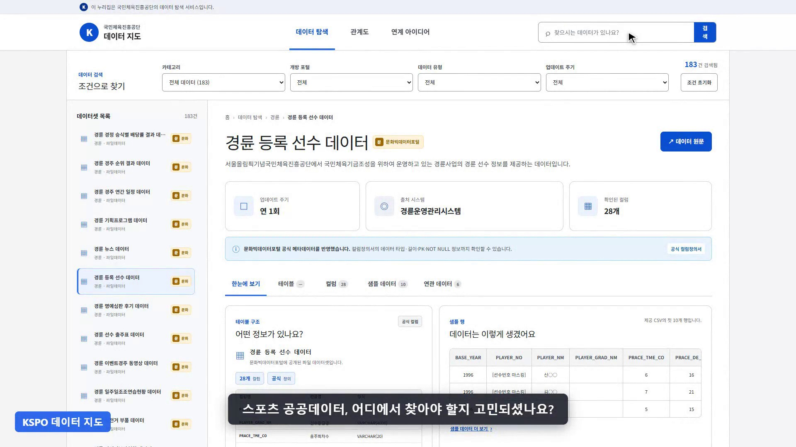
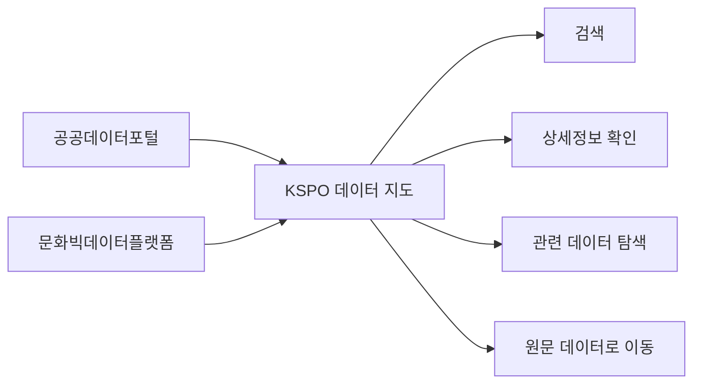
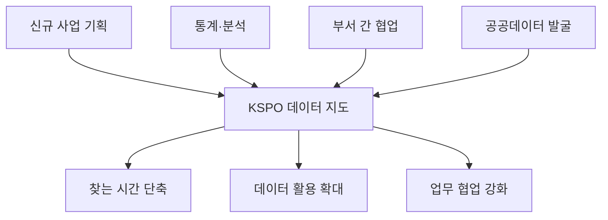
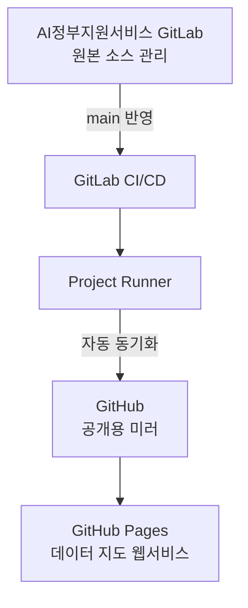

# KSPO 데이터 지도

> **KSPO 데이터 지도는 업무 질문에 맞는 공개데이터를 찾고, 컬럼·샘플·이용조건을 확인해 활용 가능성을 판단하도록 돕는 데이터 탐색 도구입니다.**
> 두 포털(공공데이터포털·문화빅데이터포털)에 나뉘어 개방된 공단 데이터 192건을 한 화면에 연결하고, 선택형 AI 추천으로 관련 데이터와 활용 조합을 안내합니다.

### 👉 [KSPO 데이터 지도 바로가기](https://pinkshark1.github.io/kspo_data_explorer/)

---

## KSPO 데이터 지도 사용방법

공공데이터를 쉽고 빠르게 찾는 방법을 영상으로 확인해보세요.

<p align="center">
  <a href="https://youtu.be/_-BNy6RB8Xk">
    
  </a>
</p>

<p align="center"><strong>▶ 클릭하여 사용방법 영상 보기</strong></p>

---

### 왜 만들었나요?

공단의 데이터는 **공공데이터포털, 문화빅데이터플랫폼 등 여러 곳에 나뉘어 공개**되어 있습니다.

따라서 필요한 데이터가 있어도

- 우리 공단에 어떤 데이터가 있는지
- 어디에서 공개되고 있는지
- 비슷하거나 연관된 데이터는 무엇인지
- 실제 파일이나 API는 어디에서 받을 수 있는지

를 각각 찾아봐야 했습니다.

**KSPO 데이터 지도는 이 과정을 한 화면에서 할 수 있도록 만든 공개데이터 안내 지도입니다.** (공단 내부 데이터 전체가 아니라, 두 포털에 개방된 데이터만 다룹니다.)


```mermaid
flowchart LR
    A[공공데이터포털] --> D[KSPO 데이터 지도]
    B[문화빅데이터플랫폼] --> D
    D --> E[검색]
    D --> F[상세정보 확인]
    D --> G[관련 데이터 탐색]
    D --> H[원문 데이터로 이동]
```

---

## 이 화면에서 무엇을 할 수 있나요?

| 하고 싶은 일 | 데이터 지도에서 할 수 있는 것 |
|---|---|
| **공단이 어떤 데이터를 개방했는지 알고 싶다** | 데이터명·키워드로 통합 검색 |
| **업무 질문에 맞는 데이터를 찾고 싶다** | ‘질문 검색’에 문장으로 질문 → 이유와 함께 추천 (기본 검색은 AI 없이, 선택하면 AI 추천) |
| **필요한 데이터만 골라보고 싶다** | 분야, 개방 포털, 제공형태(파일·API), 업데이트 주기로 필터 |
| **쓸 수 있는 데이터인지 판단하고 싶다** | 설명·컬럼 정의·샘플 행·포털 수정일·이용허락범위를 한 화면에서 확인 |
| **비슷한 데이터도 같이 보고 싶다** | 연관 데이터와 관계도(정보시스템·분야·데이터)로 연결 확인 |
| **실제 데이터를 받고 싶다** | 공공데이터포털·문화빅데이터플랫폼 원문 페이지로 바로 이동 |

### 한마디로

**찾기 → 확인하기 → 관련 데이터 보기 → 실제 데이터 이용하기**까지 한 번에 이어집니다.


```mermaid
flowchart LR
    A[① 검색<br/>원하는 데이터 찾기] --> B[② 필터<br/>필요한 것만 좁히기]
    B --> C[③ 상세보기<br/>내용 확인]
    C --> D[④ 관계보기<br/>관련 데이터 확인]
    D --> E[⑤ 원문 이동<br/>파일·API 이용]
```

---

## 업무 해결 사례: “체육시설 안전 사업에 쓸 공개데이터가 있을까?”

| 단계 | 기존 방식 | KSPO 데이터 지도 |
|---|---|---|
| 찾기 | 공공데이터포털과 문화빅데이터포털에서 ‘체육시설’, ‘안전’, ‘안전점검’ 등 검색어를 바꿔 가며 각각 검색 | ‘질문 검색’에 문장 그대로 입력 → 기본 검색이 관련어(안전점검·체육시설안전·안전관리)까지 넓혀 8건을 일치 이유와 함께 추천 (AI 호출 없음) |
| 판단 | 후보마다 포털 상세 페이지를 열어 컬럼·이용조건을 따로 확인 | 상세 화면에서 컬럼 정의·샘플 행·이용허락범위·포털 수정일을 바로 비교, ‘연관 데이터’로 같은 출처 시스템 데이터까지 확인 |
| 더 보기 | - | (선택) AI 추천이 후보 데이터의 설명 요약·컬럼을 읽고 추천 이유와 함께 쓸 조합을 제안. 실패하면 기본 검색 결과로 전환 |
| 받기 | 다시 포털에서 해당 데이터를 찾아 이동 | ‘데이터 원문’ 버튼으로 해당 포털의 데이터 페이지로 이동 |

이 질문의 실제 기본 검색 결과(상위: 체육시설안전점검정보, 체육시설 안전점검 결함사진 학습 데이터, 전국체육시설 안전점검 정보 …)는 [docs/evidence](docs/evidence/) 의 비교 기록에 있습니다. 찾는 시간이 얼마나 줄어드는지는 아직 측정 전이며, [소규모 사전 사용성 점검](docs/EFFECT_MEASUREMENT.md)으로 잴 예정입니다.

---

## 언제 쓰면 좋나요?

### 1. 신규 사업을 기획할 때
> “이 사업과 관련해 우리 공단에 이미 활용할 수 있는 데이터가 있나?”

관련 데이터를 먼저 확인해 **사업 기획의 근거자료**로 활용할 수 있습니다.

### 2. 통계·분석 자료를 만들 때
> “필요한 데이터가 어디에 공개되어 있지?”

여러 사이트를 각각 검색하지 않고 **관련 데이터 후보를 먼저 찾아 비교**할 수 있습니다.

### 3. 다른 부서와 협업할 때
> “다른 업무에서 비슷한 데이터를 이미 가지고 있지 않을까?”

관련 데이터와 연결관계를 확인해 **중복 수집을 줄이고 데이터 연계 가능성**을 찾을 수 있습니다.

### 4. 공공데이터를 추가로 개방할 때
> “이미 공개된 데이터와 아직 부족한 데이터는 무엇일까?”

현재 공개된 데이터 자산을 먼저 파악해 **신규 개방 후보 발굴**에 활용할 수 있습니다.


```mermaid
flowchart TB
    A[신규 사업 기획] --> E[KSPO 데이터 지도]
    B[통계·분석] --> E
    C[부서 간 협업] --> E
    D[공공데이터 발굴] --> E
    E --> F[찾는 시간 단축]
    E --> G[데이터 활용 확대]
    E --> H[업무 협업 강화]
```

---

## 사용 방법은 어렵지 않습니다

별도의 프로그램 설치나 회원가입 없이 웹 브라우저에서 바로 사용할 수 있습니다.

### STEP 1. 데이터 지도에 접속합니다

👉 **https://pinkshark1.github.io/kspo_data_explorer/**

### STEP 2. 찾고 싶은 단어를 검색합니다

예를 들어 다음과 같이 검색할 수 있습니다.

- 체력
- 스포츠강좌
- 체육시설
- 경륜·경정
- 스포츠산업
- 체육진흥기금

### STEP 3. 필요한 조건으로 범위를 좁힙니다

분야, 데이터 출처, 제공 형태, 업데이트 주기 등을 이용해 필요한 데이터만 확인합니다.

### STEP 4. 데이터 상세정보와 관련 데이터를 확인합니다

해당 데이터의 설명과 제공 정보를 보고, 연관된 데이터가 있다면 관계도에서 함께 살펴봅니다.

### STEP 5. 필요하면 원문 데이터로 이동합니다

실제 활용이 필요하면 연결된 공공데이터포털 또는 문화빅데이터플랫폼 등으로 이동해 원문 데이터를 확인합니다.

---

## 기존 방식과 무엇이 다른가요?

| 기존 | KSPO 데이터 지도 |
|---|---|
| 여러 사이트를 각각 방문 | **한 화면에서 먼저 통합 탐색** |
| 정확한 데이터명을 알아야 찾기 쉬움 | **키워드·분류로 탐색하거나 문장으로 질문** |
| 쓸 수 있는지 상세 페이지를 하나씩 열어 확인 | **컬럼·샘플·이용조건을 한 화면에서 비교** |
| 데이터 하나씩 개별 확인 | **관련 데이터를 함께 확인** |
| 어디서 원문을 받는지 다시 검색 | **원문 공개 사이트로 바로 이동** |

> **핵심은 데이터를 새로 만드는 것이 아니라, 이미 공단이 보유·개방하고 있는 데이터를 더 쉽게 발견하고 활용하도록 돕는 것입니다.**

---

## 기대 효과

아래는 측정 전의 **기대**입니다. 실제 수치는 [소규모 사전 사용성 점검](docs/EFFECT_MEASUREMENT.md)으로 측정한 값만 적습니다.


```mermaid
flowchart LR
    A[데이터 찾는 시간 ↓] --> B[업무 효율 ↑]
    B --> C[데이터 활용 ↑]
    C --> D[부서 간 협업 ↑]
    D --> E[신규 데이터 발굴 ↑]
```

- **데이터 접근성 향상** : 공단 데이터를 어디서 찾아야 하는지 쉽게 파악
- **업무시간 단축** : 여러 플랫폼을 반복 검색하는 시간 감소
- **데이터 활용 확대** : 기존 데이터의 재발견 및 분석·기획 활용 촉진
- **협업 강화** : 다른 분야의 관련 데이터를 쉽게 확인
- **공공데이터 발굴 지원** : 현재 개방 현황을 바탕으로 추가 개방 후보 검토

---

# 운영자 참고

아래 내용은 일반 이용자가 아니라 **데이터 지도 운영·관리 담당자와 심사·검토자**를 위한 내용입니다.

## 내 PC에서 실행하기

Node.js 20 이상이 필요합니다. 화면 파일(`assets/`)이 이미 빌드되어 있어 실행만 할 때는 패키지 설치가 필요 없습니다.

```bash
git clone https://gitlab.aigov.go.kr/doongju1/kspo_data_explorer.git
cd kspo_data_explorer
npm start                     # http://localhost:4173 (종료: Ctrl+C)
```

- `index.html` 을 파일로 직접 열면(file://) 데이터를 읽지 못하므로 위처럼 웹서버로 엽니다.
- 소스(`src/`)를 고쳤다면 `npm install` → `npm run build` 로 화면 파일을 다시 만듭니다.
- 다른 데이터 폴더로 띄우기: `npm start -- --data examples/korea-sports-council/data` (대한체육회 공개데이터 이식 시험, [사례](examples/korea-sports-council/README.md))
- 점검(먼저 `npm install` - 화면 점검 도구가 들어 있음): `npm run check:data`(데이터) · `npm run check:ui`(화면, Chrome 또는 Edge 필요) · `npm run check:search`(질문 검색 품질) · `npm run check:ai`(AI 경로, 모의 서버) · `npm run evidence`(네 점검을 한 번에 실행해 [docs/evidence](docs/evidence/)에 기록)

## 주요 기능과 작동 방식

| 기능 | 작동 방식 |
|---|---|
| 데이터 탐색 | `data/explorer-data.json`(목록·컬럼·샘플)과 `data/portal-meta.json`(포털 수정일·이용허락범위)을 브라우저가 읽어 검색·필터·상세를 구성 |
| 관계도 | 데이터의 출처 시스템·분야로 묶은 연결을 캔버스에 그림 (노드 검색·확대·펼치기) |
| 질문 검색 - 기본 검색 | 질문에서 낱말을 뽑고 유의어 사전(`src/ai/thesaurus.js`)으로 넓혀 이름·키워드·컬럼·설명 일치를 점수화. AI 호출 없이 브라우저 안에서 처리 |
| 질문 검색 - AI 추천(선택) | 기본 검색 상위 후보(최대 30건, 검색이 약하면 전체 목록을 이름·분야만으로)의 이름·분야·설명 요약·컬럼을 이용자 본인 키로 Google Gemini API에 보내 추천 이유·관련도·활용 조합을 받음. 후보 밖 번호는 버리고, 실패하면 기본 검색 결과로 전환 |

### AI 추천 설정

- 모델: `data/site.json` 의 `ai.gemini.models` - Gemini 3.5 Flash-Lite(`gemini-3.5-flash-lite`, 기본), Gemma 4 31B(`gemma-4-31b-it`, 오픈 모델). 같은 키로 화면의 ‘모델’ 칸에서 고릅니다.
- 키: 화면의 ‘Gemini API 키’ 칸에 입력하며 이 페이지의 메모리에서만 쓰고 저장하지 않습니다. 소스·데이터·문서에 키를 넣지 않습니다.
- 교체: 같은 서비스의 다른 모델은 `ai.gemini.models` 에 추가, 다른 서비스는 `src/ai/providers/` 에 같은 형태의 파일을 추가합니다. 자세한 내용은 [docs/AI_FEATURE.md](docs/AI_FEATURE.md).
- 기관 AI 서버 연결 규격(운영하지 않음): 요청 `{ question, candidates }` → 응답 `{ summary, recommendations[{ no, relevance, reason }], combinations[{ title, nos, idea }] }`. 참조 구현은 `scripts/ai-gateway.mjs` 이며 `ai.modes` 에 `gateway` 를 켜고 서버 주소를 넣어야 동작합니다.
- 개발 이력: Claude·GPT 연결도 만들어 시험했으나(커밋 `e5a578f`) Claude는 유료 요금, GPT는 사용 한도 오류 때문에 제외하고 Gemini만 남겼으며(`83353a1`), 이후 같은 키로 쓰는 Gemma를 추가했습니다(`2e756eb`).

## 검증 결과

| 검증 항목 | 실행 환경·모델 | 확인일 | 결과 | 증빙 위치 |
|---|---|---|---|---|
| 데이터 점검 (`check:data`) | Node.js 24 · Windows 11 | 2026-10-02 | 오류 0건 · 경고 0건 (192건) | [docs/evidence](docs/evidence/) `*-checks.md` |
| 화면 점검 (`check:ui`) | Chrome(헤드리스) · 데스크톱 1440px, 모바일 390·360px | 2026-10-02 | 40/40 통과 | 같은 파일 |
| 질문 검색 품질 (`check:search`) | AI 없음 (기본 검색) · 질문 39개 | 2026-10-02 | 상위 5건 적중률 100% · 상위 10건 재현율 97% | 같은 파일 |
| AI 경로 (`check:ai`) | 모의 서버 (실제 호출 없음) | 2026-10-02 | 71/71 통과 | 같은 파일 |
| 기본 검색 · AI 실패 전환 비교 (`compare:ai`) | 예시 질문 5개 · 모의 오류(한도 초과·잘못된 키) | 2026-10-02 | 실패 시 두 경우 모두 기본 검색 8건으로 전환 | [docs/evidence](docs/evidence/) `*-ai-compare.md` |
| AI 추천 실제 호출 (`probe:ai`·`compare:ai`) | Google Gemini API · `gemini-3.5-flash-lite`, `gemma-4-31b-it` | 2026-10-06 | 예시 질문 5개 비교: Flash-Lite 5/5 응답(평균 3.5초), Gemma 4/5 응답(평균 78.7초, 1건은 Google 쪽 500·503·시간 초과로 실패해 기본 검색으로 전환). 추천 이유 51개 모두에 그 데이터의 설명·컬럼과 같은 낱말이 있음(낱말 대조이며 품질 평가는 아님). 모델 점검(10-02): 두 모델 모두 응답 | [ai-compare](docs/evidence/2026-10-06-ai-compare.md) · [ai-probe](docs/evidence/2026-10-02-ai-probe.txt) |
| 다른 기관 데이터 이식 | 대한체육회 공공데이터포털 개방 데이터 23건 | 2026-10-02 | 기관별 화면 코드 수정 없이(처음 이식할 때 KSPO 고정 문구를 설정값으로 정리) 데이터 점검 오류 0건 · 화면 점검 14/14 | [examples/korea-sports-council](examples/korea-sports-council/README.md) |
| 행정안전부 AI 공통기반 구동 | - | - | 하지 않음 (공통기반 접속 환경 없음) | - |
| 소규모 사전 사용성 점검 | 직원 3~5명 · 과제 3개 × 2방식 | - | 측정 전 | [docs/EFFECT_MEASUREMENT.md](docs/EFFECT_MEASUREMENT.md) |

## 서비스 운영 구조

개발·원본 관리는 **AI정부지원서비스 GitLab**, 공개 웹페이지는 **GitHub Pages**를 이용합니다.


```mermaid
flowchart TB
    A[AI정부지원서비스 GitLab<br/>원본 소스 관리] -->|main 반영| B[GitLab CI/CD]
    B --> C[Project Runner]
    C -->|자동 동기화| D[GitHub<br/>공개용 미러]
    D --> E[GitHub Pages<br/>데이터 지도 웹서비스]
```

| 구분 | 역할 |
|---|---|
| **GitLab** | 원본 소스 관리 및 수정 |
| **GitHub** | 외부 공개를 위한 미러 저장소 |
| **GitHub Pages** | 실제 데이터 지도 웹서비스 |

> **운영 원칙: GitLab = 원본 / GitHub = 공개용 미러 / GitHub Pages = 서비스 화면**

정상적인 운영 시 GitLab의 `main` 브랜치에 변경사항을 반영하면 CI/CD를 통해 GitHub로 동기화되고 웹페이지에 반영됩니다.

### 저장소 구성

```text
kspo_data_explorer/
├─ index.html          # 화면 진입점 (배포 대상)
├─ assets/             # 빌드된 화면 파일(app.js·app.css)·글꼴·오픈소스 고지 (배포 대상, npm run build 로 생성)
├─ data/               # 기관 설정(site.json)·데이터 목록(explorer-data.json)·포털 정보(portal-meta.json) (배포 대상)
├─ src/                # 화면 소스(React)와 질문 검색(src/ai)
├─ scripts/            # 로컬 서버·점검·포털 정보 수집·샘플 마스킹 스크립트
├─ docs/               # 데이터 구조, AI 기능, 다른 기관 적용, 효과 측정, 점검 기록(evidence)
├─ examples/           # 다른 기관 데이터 이식 시험 (화면은 이 폴더를 읽지 않음)
└─ .gitlab-ci.yml      # GitLab → GitHub 자동 동기화 설정
```

---

## 관련 주소

- **KSPO 데이터 지도**: https://pinkshark1.github.io/kspo_data_explorer/
- **GitHub 공개 미러**: https://github.com/pinkshark1/kspo_data_explorer
- **원본 GitLab**: `https://gitlab.aigov.go.kr/doongju1/kspo_data_explorer`

---

### 이 프로젝트가 지향하는 것

> **“공단에 어떤 데이터가 있는지 몰라서 활용하지 못하는 일을 줄이는 것.”**
>
> KSPO 데이터 지도는 데이터를 단순히 나열하는 목록이 아니라, **필요한 데이터를 발견하고 실제 활용까지 이어주는 데이터 탐색 창구**를 목표로 합니다.
