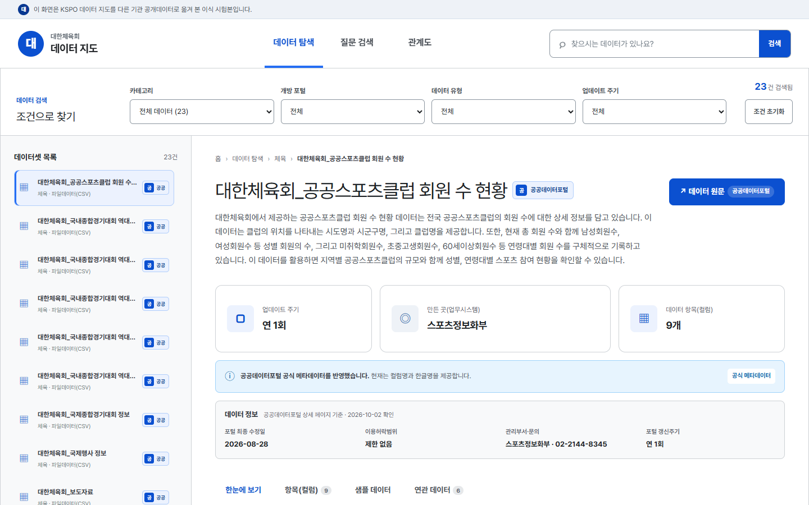
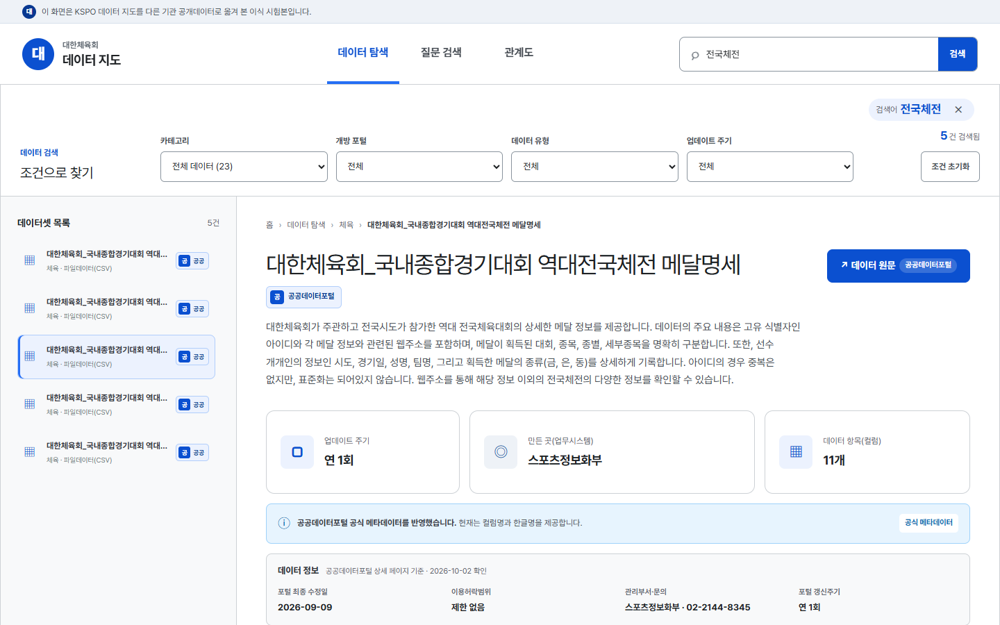
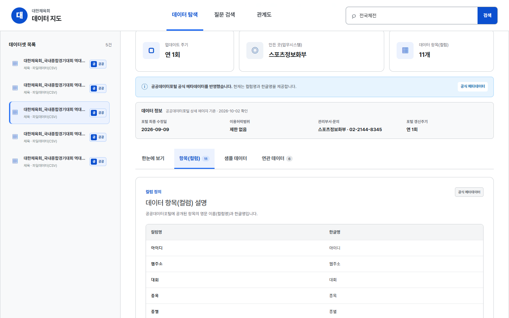
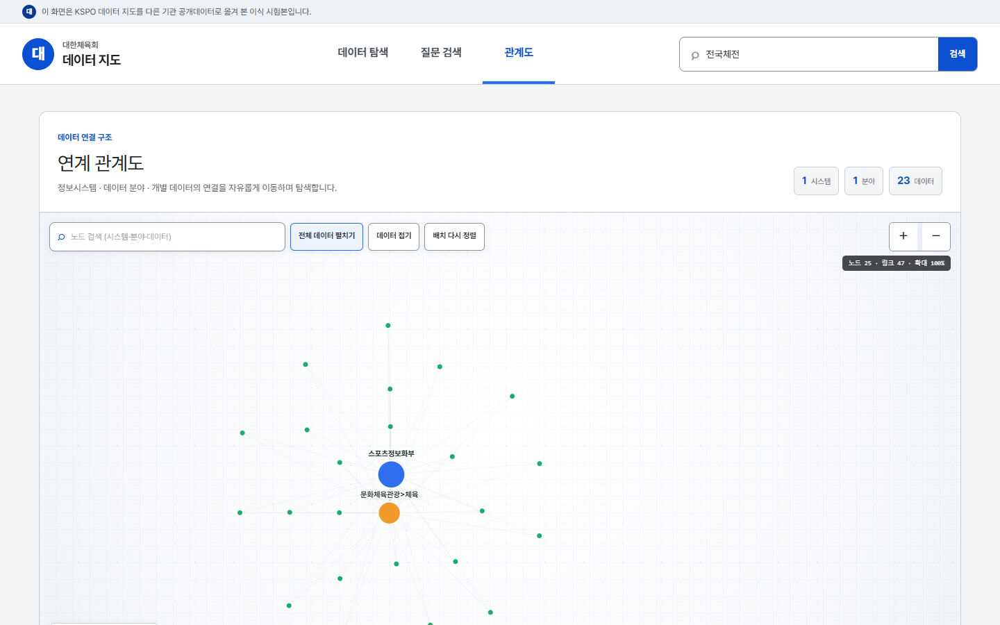
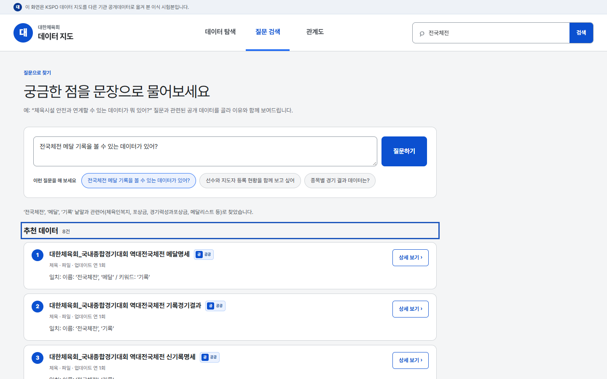
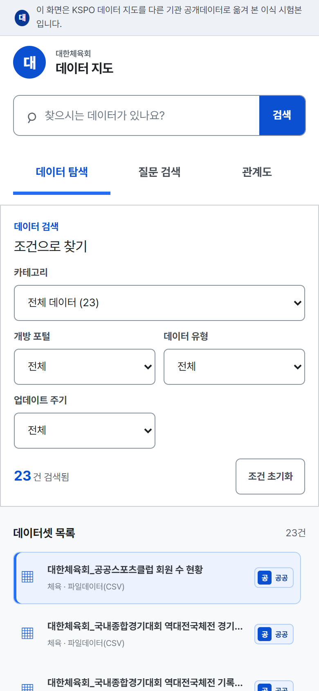

# 이식 시험: 대한체육회 공개데이터로 데이터 지도 띄우기

KSPO 데이터 지도를 **다른 기관의 공개데이터로 옮겨도 그대로 동작하는지** 확인한 시험입니다.
공공데이터포털에 제공기관 ‘대한체육회’로 개방된 데이터 23건(2026-10-02 기준)을 모아, 화면 코드는 그대로 두고 `data/` 폴더만 바꿔 띄웠습니다.

> 이 폴더는 시험 기록입니다. 대한체육회가 운영하는 서비스가 아니며, 운영 배포에 필요한 파일(`index.html`·`assets/`·`data/`)이 아니라 KSPO 데이터 지도 화면은 이 폴더를 읽지 않습니다.

## 결과 요약 (2026-10-02 실행)

| 항목 | 결과 |
|---|---|
| 수집한 데이터 | 23건 (파일 23 · API 0). 이 중 18건은 포털의 ‘데이터 항목(컬럼) 정보’ 162개를 함께 가져옴, 5건은 포털에 컬럼 정보가 없음 |
| 데이터 점검 (`validate-data --data`) | 오류 0건 · 경고 2건 (컬럼 정의 없음 5건, 샘플 없음 23건 - 아래 ‘한계’) |
| 화면 점검 (`check.mjs`) | 14/14 통과 - 목록 23건, 검색, 상세·원문 링크, 컬럼 사전, 관계도, 질문 검색(기본 검색, 예시 질문 3개 모두 결과 8건), 모바일 390px, 콘솔 오류·404 없음 |
| 화면 코드 수정 | 0건 (이 기관만을 위한 수정 없음. 아래 ‘공통으로 고친 곳’은 처음 옮길 때 한 번 정리한 것) |
| 자동 처리 시간 | 2회 실행에 45.4초·74.3초 (`update.mjs` 출력). 대부분 포털 응답 대기라 실행마다 다름 - 아래 표 |

| 단계 | 1회차 | 2회차 |
|---|---|---|
| 목록 수집 (`collect.mjs`, 목록 2쪽 + 상세 23건 요청) | 20.2초 | 18.0초 |
| 포털 정보 수집 (`fetch-portal-metadata.mjs --data`) | 40.7초 | 16.2초 |
| 데이터 점검 (`validate-data.mjs --data`) | 0.1초 | 0.1초 |
| 화면 점검 (`check.mjs`) | 13.3초 | 11.0초 |
| 합계 | 74.3초 | 45.4초 |

(1회차는 화면 점검 13개 항목일 때, 2회차는 ‘예시 질문마다 결과’ 항목을 더한 14개일 때)

사람이 손으로 쓴 것은 `data/site.json` 한 파일(46줄: 기관명·안내 문구·포털 주소·예시 질문)입니다. 작성에 걸린 사람 시간은 재지 않았습니다.

## 화면

| 목록 | 상세 | 컬럼 사전 |
|---|---|---|
|  |  |  |

| 관계도 (전체 데이터 펼침) | 질문 검색 (기본 검색) | 모바일 |
|---|---|---|
|  |  |  |

## 필요한 데이터 항목과 가져온 곳

데이터 지도의 목록 한 건(`catalog` 항목, [DATA_SCHEMA.md](../../docs/DATA_SCHEMA.md))을 무엇으로 채웠는지입니다. 포털에 없는 값은 지어내지 않았습니다.

| 항목 | 뜻 | 이 시험에서 가져온 곳 |
|---|---|---|
| `no` | 데이터 번호 | 수집 순서(파일 → API, 이름순)로 1부터 |
| `ch` | 개방 포털·유형 | 목록의 링크 형태 (`fileData` → `공공데이터포털(파일)`) |
| `name`, `desc`, `kw` | 이름·설명·키워드 | 목록의 제목·키워드, 상세 페이지의 ‘설명’ |
| `field` | 분야(카테고리) | 상세 페이지의 ‘분류체계’ (`문화체육관광 - 체육` → `문화체육관광>체육`) |
| `cycle` | 업데이트 주기 | 상세 페이지의 ‘업데이트 주기’ (`연간`, `수시 (1회성 데이터)`) |
| `sys` | 출처 시스템 (관계도의 ‘정보시스템’) | 포털에 없음 → 컬럼 정보의 ‘생성출처 - 정보시스템명’이 비어 있어 **‘관리부서명’(스포츠정보화부)으로 대신 묶음** |
| `url` | 원문 주소 | 목록의 상세 페이지 주소 |
| 컬럼 (`payloads[3].columns`) | 컬럼명·한글명 | 상세 페이지의 ‘데이터 항목(컬럼) 정보’ 표 |
| 이용허락범위·관리부서·수정일 | ‘데이터 정보’ 영역 | `scripts/fetch-portal-metadata.mjs --data` (KSPO와 같은 스크립트) |

## 바꾼 파일

**이 기관을 위해 만든 것** (모두 이 폴더 안)

| 파일 | 내용 |
|---|---|
| `data/site.json` | 기관명·안내 문구·포털 주소·질문 검색 예시 (손으로 작성) |
| `data/explorer-data.json` | `collect.mjs` 가 만든 목록·컬럼 |
| `data/portal-meta.json` | `fetch-portal-metadata.mjs --data` 가 만든 포털 정보 |
| `collect.mjs` | 공공데이터포털 목록·상세 화면에서 위 항목을 읽는 수집 스크립트 |
| `check.mjs`, `update.mjs` | 화면 점검, 갱신 한 번에 실행 |

**공통으로 고친 곳** (처음 옮길 때 KSPO 고정값이 드러나 한 번 정리. KSPO 화면은 그대로이며 `npm run check:ui` 40/40 통과)

| 고친 곳 | 전 | 후 |
|---|---|---|
| `src/components/SiteHeader.jsx` | 로고 글자 `K` 고정, 메뉴 항상 표시 | `organization.mark`(없으면 약칭 첫 글자). 연계 아이디어가 없으면 메뉴에서 뺌 |
| `src/components/SiteFooter.jsx`, `DatasetProfile.jsx` | ‘공단 데이터 목록’ 고정, 두 포털 건수 항상 표시 | `organization.callName`(없으면 기관명). 수록 0건인 포털은 뺌 |
| `src/lib/catalog.js` | 주기 `수시 (1회성 데이터)` 를 모름 | ‘수시’로 묶음 |
| `scripts/serve.mjs`, `validate-data.mjs`, `fetch-portal-metadata.mjs`, `lib/static-server.mjs` | `data/` 폴더만 사용 | `--data <폴더>` 로 다른 데이터 폴더 지정 |
| `scripts/validate-data.mjs` | `guide`(사용방법) 필수 | 선택 (화면은 원래 없으면 메뉴를 뺌) |

## 실행·갱신 절차

```bash
npm install                                        # 처음 한 번
npm run build
node examples/korea-sports-council/update.mjs      # 수집 → 포털 정보 → 데이터 점검 → 화면 점검 (단계별 시간 출력)
npm start -- --data examples/korea-sports-council/data   # http://localhost:4173 에서 화면 보기
```

포털에 데이터가 새로 올라오거나 바뀌면 `update.mjs` 를 다시 실행합니다. 점검이 실패하면 그 단계에서 멈춥니다. 실제 기관이 쓸 때는 이 폴더의 `data/` 세 파일을 저장소의 `data/` 에 넣고 KSPO와 같은 방식(`index.html`·`assets/`·`data/` 정적 배포)으로 올리면 됩니다.

## 한계와 발견한 점

- **관계도가 단조롭다.** 포털 분류체계가 23건 모두 `문화체육관광>체육`, 관리부서도 하나라서 관계도가 ‘시스템 1 · 분야 1’로만 나뉩니다(펼치면 데이터 23건이 한 묶음에 붙음). 관계도를 쓸모 있게 하려면 **기관이 자체 분야와 출처 시스템을 정해 `field`·`sys` 에 넣어야** 합니다. KSPO는 이 값을 담당자가 정리했습니다.
- **샘플 행은 넣지 않았다.** 메달명세·선수등록정보 등에 선수 성명이 있어, 넣으려면 `scripts/mask-sample-data.mjs` 로 가리고 담당자가 확인해야 합니다. 화면은 ‘샘플 미제공’으로 안내합니다.
- **컬럼 정보 5건 없음.** 포털 상세 페이지에 컬럼 표가 없는 데이터(#3, #14, #16, #18, #19)는 비워 두었습니다.
- **질문 검색의 관련어 사전(`src/ai/thesaurus.js`)은 KSPO 데이터에 맞춘 것**입니다. 대한체육회 질문에서도 결과는 나오지만(예시 질문 3개 모두 1위가 질문에 맞는 데이터: 메달명세 · 지도자등록정보 · 경기결과및기록), 기관 용어에 맞게 관련어를 보완하면 더 정확해집니다. 질문 검색 화면의 안내 예문 한 줄도 KSPO 기준 그대로입니다.
- 두 포털(공공데이터포털·문화빅데이터포털) 구조를 전제로 하므로, 문화빅데이터포털 데이터가 없어도 `portals.culture` 설정은 채워야 합니다(화면에는 나오지 않음).
- 목록 수집(`collect.mjs`)은 2026-10-02 공공데이터포털 화면 구조에 맞춘 것이라 포털 화면이 바뀌면 고쳐야 합니다.
